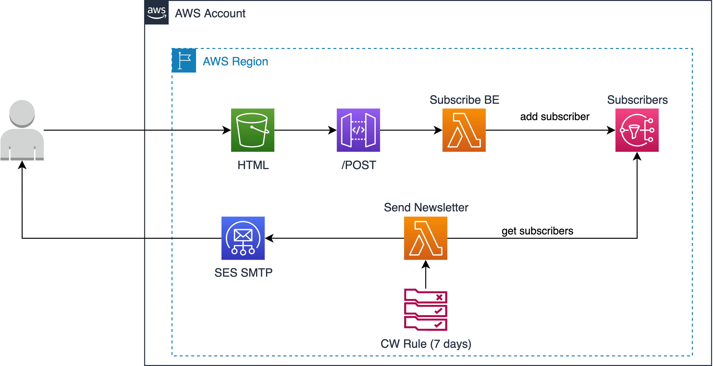

# AWS Newsletter via E-Mail :mailbox:




## Prerequisites :raising_hand:
* Active AWS credentials
* pip
* [AWS SAM CLI](https://docs.aws.amazon.com/serverless-application-model/latest/developerguide/serverless-sam-cli-install.html)
* SES in production mode (see [here](https://docs.aws.amazon.com/ses/latest/dg/request-production-access.html))
* Verified Domains and/or E-Mail Id in SES (see [here](https://docs.aws.amazon.com/ses/latest/dg/creating-identities.html))

## Installation :construction_worker:
1. Check the values in `Parameters` section in [template.yaml](./template.yaml) and adjust to your needs
2. Run following commands:
	````
	pip install -r src/newsletter_email/requirements.txt -t src/newsletter_email/dependencies/python
	sam deploy --guided
	````

See these example values for SAM:
```
	Stack Name [sam-app]: awsnewsletteremailer
	AWS Region [eu-central-1]: 
	Confirm changes before deploy [y/N]: N
	Allow SAM CLI IAM role creation [Y/n]: Y 
	Disable rollback [y/N]: N
	NewsletterSubscribersFunction may not have authorization defined, Is this okay? [y/N]: y
	Save arguments to configuration file [Y/n]: Y
	SAM configuration file [samconfig.toml]: <ENTER>
	SAM configuration environment [default]: <ENTER>
```

## Usage :running:
Open the URL given in the output of the SAM deployment. Enjoy! :sunglasses: :star2: